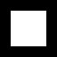
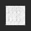

# GAN
Generative adversarial network with deconvolutional NN as a generator and convolutional - as a discriminator.

Original Cube             |  Generated Cube
:-------------------------:|:-------------------------:
  |  
